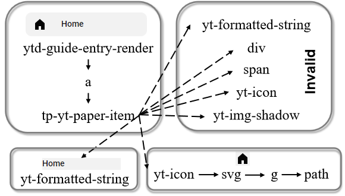
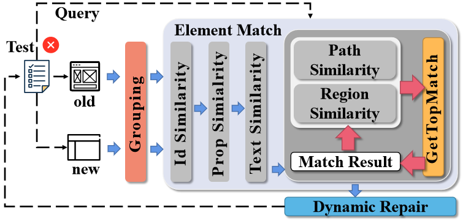

# Automated Fixing of Web UI Tests via Iterative Element Matching" (ASE23)

# Contact
If you have any questions, you can contact me.(yuanzhanglin@gmail.com)
I will continue to maintain this warehouse if I have time.

# Catalog

+ Introduction
+ Code
+ Web-UI-Dataset
+ content of dataset 
+ Related Work:
+ Implementation
+ Experimental Result

# Introduction

This is an open source dataset to facilitate the development of automated repair of Web UI test cases.

This data set mainly contains two data sets:

+ Web UI element dataset. This dataset used for test the efficiency of element matching. 

+ Web UI test case dataset. This dataset include two test case dataset from differenet papers. We tweaked the test cases and made them more stable.

Since the content of the thesis involves cooperation with enterprises, it involves `copyright issues`.We cannot open source the code of our algorithms.

Therefore, we give our experimental details in the data set, so that other researchers can reproduce our work or use the data set in our work as much as possible.

# Code

## Code for Web UI matching.

`webUIExperimentFramework` is an experimental framework for UI matching. You can run `src/main/java/frame/experiment` to start the experiment.

### config

In `main.properties`, you can config the experiment:

For example:

```
webevodata=AddressBook_Edit
algorithm=WebEvo
```

The experiment framework will execute the WebEvo algorithm to match the dataset "AddressBook_Edit"  and the "AddressBook_Edit" is located in the `./data/`.

The algorithm can be configured as WATER, VISTA, SFTM, SFTM2023, WebEvo. You can also write your algorithm in the framework.

We are so sorry for  that we can not open source our algorithm because the copyright of the cooperating company.

## Code for Web Test case Repair.

`WebUIAutoRepair` is an experimental framework for UI test case repair. 

### How to run it.
You should make sure to compile test cases with the `Ajc` compiler.
#### Execute on old versions.
Modify the `version` in the `config.properties` to `old` and execute the test case.
#### Execute on new versions.
Modify the `version` in the `config.properties` to `new` and execute the test case.

### config.

Control the currently executed version by modifying the `version` of the `config.properties`.

Control which method is used to match elements by modifying the `match` of the `config.properties`.

Control the currently executed browser driver version by modifying the `chrome_version` of the `config.properties`.

Note that, you should change `10.16.10.235` in the `config.UrlConfig` file to your server ip.

# Web-UI-Dataset

## Intro for Web UI Dataset

There is a more troublesome problem in the data set of element matching. There may be multiple elements in a web page representing a function.



In terms of distance, `ytd-guide-entry-render` and `td-guide-entry-render/a` and `ytd-guide-entry-render/a/tp-yt-paper-item` express a function. Therefore, when we match, we think that any element representing the same function is correct to match any element representing the same function in the new version.

Therefore, in the example, the following matching results are all correct.

+ `ytd-guide-entry-render` - `td-guide-entry-render/a`
+ `ytd-guide-entry-render` - `td-guide-entry-render/a/tp-yt-paper-item`
+ `ytd-guide-entry-render` - `td-guide-entry-render`
+ ...

For easier labeling, we group these elements with the same function to a node. In this example, we save the `ytd-guide-entry-render` element.

# content of dataset

For each directory, `result/result.json` is the matching result. The `old` folder is the information on the old version of the webpage, and the `new` folder is the information on the new version of the webpage.

In each data set:

**preDomNodeInfo.json** : the information of the elements (XPath,Tag,attribute,text...   ). for element x:

- elementId :"int", the index of element, x.

- parent : "int", the index of the parent node.

- attributes: "hashmap", the mapping of attributes \<attr name, attr value \>

- validchildren: "arraylist", the valid (after filtering) child nodes.

- children : "arraylist", all child nodes(before filtering).

- isDisplayed :"boolean", the element is displayed or not.

- isCoreElement: "boolean", the element is  the saved element after grouping or not.

- coreElementId:"int", the index of the element that element x was merged into.
  
  **domNodeInfo.json** : the data after grouping.

- domPath: "arraylist", the group path from root node to the parent node.

- leafChildren :"arraylist", all leaf node in the subtree.

- isLeaf : "boolean", the element is leaf node or not.

- elementType: "int", 1(non-leaf node ),2(leaf node without text) ,3(leaf node with text)

- newElementId : "int", the index of group(element after grouping).

- parent : "int", the index of the parent group(element after grouping).
+ fullScreen.png : a long screenshot of the page.

+ old.html/new.html:  the HTML of web page.

+ index.png : the screenshots of each group (element after grouping).

In result.json:

+ "matchMap":  a map of the index of matching elements. \<old Index,new Index\>
+ "addList": a list of the index of added element in new web page.
+ "deleteList": a list of the index of deleted element in old web page.

## Web-UI-Matching dataset

The distribution of the type (all nodes) is as follows:
| update  |  delete |add|total|
| ----  |----  |----  |----  |
| 2627  | 485 |555|3667|

The distribution of the time is as follows:

| application         | version 1 | version 2 |
| ------------------- | --------- | --------- |
| www.yahoo.com       | 2017.02   | 2019.06   |
| www.wikipedia.com   | 2019      | 2022      |
| www.paypal.com      | 2019.03   | 2020.03   |
| www.instagram.com   | 2019.03   | 2021.03   |
| www.fandom.com      | 2022.03   | 2022.12   |
| www.twitter.com     | 2021.08   | 2022.08   |
| www.youtube.com     | 2022.08   | 2023.02   |
| www.facebook.com    | 2020.08   | 2022.08   |
| book.douban.com     | 2016.08   | 2019.08   |
| beijing.douban.com  | 2017.10   | 2019.10   |
| www.foodnetwork.com | 2018.11   | 2019.11   |
| www.w3school.com    | 2016.01   | 2019.01   |
| movie.douban.com    | 2014.11   | 2019.11   |
| www.amazon.com      | 2017.08   | 2020.08   |
| www.apple.com       | 2018.02   | 2020.08   |
| www.linkedin.com    | 2019.08   | 2020.08   |
| www.usps.com        | 2018.08   | 2020.08   |
| www.xfinity.com     | 2018.08   | 2020.08   |

## Web-TestScriptDataSet

### Directory

We have compiled the test cases of the two papers and can run them locally.
The test cases of paper **An automated model-based approach to repair test suites of evolving web applications.** are placed under folder `model_based_dataset`.

**model_based_dataset**

> Imtiaz, Javaria, and Muhammad Zohaib Iqbal. "An automated model-based approach to repair test suites of evolving web applications." Journal of Systems and Software 171 (2021): 110841.

dataset link:https://github.com/javariaimtiaz12/Selenium-Test-Scripts-for-Web


### Configuation:

We build the application under a unified configuration, which is convenient for experiments. We manually checked that this does not affect test case execution and experimental results.

| type   | application | version | php | mysql | apache | account       | password | link                                  |
| ------ | ----------- | ------- | --- | ----- | ------ | ------------- | -------- | ------------------------------------- |
| repair | addressbook | 6.1     | 5.3 | 5.5   | 2.4.9  | /             | /        | http://10.16.10.235/addressbookv6.1/  |
| base   | addressbook | 4.0     | 5.3 | 5.5   | 2.4.9  | /             | /        | http://10.16.10.235/addressbookv4.0/  |
| base   | mantisbt    | 1.1.8   | 5.3 | 5.5   | 2.4.9  | administrator | root     | http://10.16.10.235/mantisbt-1.1.8/   |
| repair | mantisbt    | 1.2.0   | 5.3 | 5.5   | 2.4.9  | administrator | root     | http://10.16.10.235/mantisbt-1.2.0/   |
| base   | mrbs        | 1.2.6.1 | 5.3 | 5.5   | 2.4.9  | administrator | secret   | http://10.16.10.235/mrbs-1.2.6.1/web/ |
| repair | mrbs        | 1.4.9   | 5.3 | 5.5   | 2.4.9  | administrator | secret   | http://10.16.10.235/mrbs-1.4.9/web/   |
| base   | collabtive  | 0.65    | 5.3 | 5.5   | 2.4.9  | admin         | 123456   | http://10.16.10.235/collabtive065/    |
| repair | collabtive  | 1.0     | 5.3 | 5.5   | 2.4.9  | admin         | 123456   | http://10.16.10.235/collabtive-10/    |
| base   | claroline   | 1.11.5  | 5.3 | 5.5   | 2.4.9  | admin         | 123456   | http://10.16.10.235/claroline-1.11.5  |
| repair | claroline   | 1.10.7  | 5.3 | 5.5   | 2.4.9  | admin         | 123456   | http://10.16.10.235/claroline1107     |

We configure the parameters required by the test case in the `Constants.java` file.
In `./config.properties`, the version property is provided. This property controls which version (old or new) of the web page is accessed by the test case.

We also need to pay attention that the driver directory should be created under the project, and the driver should be named according to `chromedriver_107.exe`. The driver version follows the version of your Google Chrome. At the same time, in the `DriverConfig.java` file, `CHROME_VERSION` configures the driver version, and searches for the corresponding driver according to the version.
If you want to use it directly, you can directly modify the `DRIVER_PATH` path of `DriverConfig.java` to your driver path.

# Related Work:

When we reproduced the algorithm, we referred to the code repositories of the original paper.

+ water & vista ：https://github.com/saltlab/vista
+ webevo : https://github.com/webevoexp/webevo
+ sftm: https://anonymous.4open.science/r/7ae57bd7-3b29-463a-88a4-d31c04ecfcd2/

water:

> Choudhary, Shauvik Roy, et al. "Water: Web application test repair." Proceedings of the First International Workshop on End-to-End Test Script Engineering. 2011.

vista:

> Stocco, Andrea, Rahulkrishna Yandrapally, and Ali Mesbah. "Visual web test repair." Proceedings of the 2018 26th acm joint meeting on european software engineering conference and symposium on the foundations of software engineering. 2018.

webevo:

> Shao, Fei, et al. "WebEvo: taming web application evolution via detecting semantic structure changes." Proceedings of the 30th ACM SIGSOFT International Symposium on Software Testing and Analysis. 2021.

sftm:

> Brisset, Sacha, et al. "SFTM: Fast matching of web pages using Similarity-based Flexible Tree Matching." Information Systems 112 (2023): 102126.

# Implementation

## Frame of Repair

In Aspectj, `proceedingJoinPoint.proceed();` can be used to control whether the original method is executed. Therefore, we can choose whether to execute the original method or the repair process during the dynamic execution process.

We can instrument `findElement` method and use this code to replace original method.

The pseudocode of the repair process is as follows:

```java
        beforeAction();
        WebElement webElement;
        try {
             webElement = proceedingJoinPoint.proceed();
        }catch (NoSuchElementException | InvocationTargetException){
            find match element;
        }
        afterAction();
        return webElement;
```

In `beforeAction` and `afterAction`, we can collect page info and so on.
If the original locator could not find the target webElement, we will try to find the matched element and return the found element.

Note that, we use `sourceLocation` to label an event.

## Matching

### Grouping



It is worth noting that in the process of collecting data, we should use the following tricks:

1. Use jsoup to parse all elements and get the xpath of the element. Using findElement(By.tag) to find the target element is sometimes difficult to enumerate all the tags, such as self-defined tags. Therefore, the xpath obtained by jsoup will be more complete. And note that xpaths such as svg elements should be handled specially.

2. Use JavaScriptExecutor to call java script to speed up obtaining element information. Some methods of directly calling Selenium will be time-consuming when there are many page elements, and may cause the program to crash (maybe some problems of Selenium). Therefore, it is recommended to use JavaScriptExecutor to execute script for obtaining some attributes. The code for Selenium to obtain the isDisplayed property is `./resources/isDispalyed.js`. You can call it like :

```java
        String scriptName = "/" + "isDisplayed.js";
        URL url = DomInformationCollection.class.getResource(scriptName);
        String rawFunction = Resources.toString(url, StandardCharsets.UTF_8);
        String script = String.format(
                "window.isDisplayed = function(element){return (%s).apply(null, arguments);}",
                rawFunction);
        ((JavascriptExecutor) driver).executeScript(script);
```

Effectiveness on UI Element Matching.

## Effectiveness on Repairing UI Tests

> Although we have made a lot of efforts to make the test case more stable, it may still be not stable for various reasons.
> When you reproduce this paper, try to run more times.

### reason for failure to fix:

+ Modify Assert : the assertion need to be modified.
+ unrepairable: the tested function is  moved. (excluded in the result).
+ event : add or delete events.
+ Propagated Breakages: the original locator locates the wrong element but 

### MantisBT

| test case                     | Reason for failure to fix. | water | vista | webevo   | sftm | ours |
| ----------------------------- | -------------------------- | ----- | ----- | -------- | ---- | ---- |
| AddCategoryEmptyTest          | Modify Assert              | ×     | ×     | ×        | ×    | ×    |
| AddCategoryWrongTest          |                            | ×     | ×     | ×        | ×    | √    |
| AddMultipleSubprojectsTest    |                            | √     | ×     | √        | ×    | √    |
| AddNegativeNewsTest           | unrepairable               | ×     | ×     | ×        | ×    | ×    |
| AddNegativeProfileTest        |                            | √     | ×     | √        | ×    | √    |
| AddNewsTest                   | unrepairable               | ×     | ×     | ×        | ×    | ×    |
| AddProfileTest                |                            | √     | ×     | √        | √    | √    |
| AddProjectEmptyTest           |                            | √     | ×     | √        | ×    | √    |
| AddProjectTest                |                            | √     | ×     | √        | ×    | √    |
| AddSubProjectTest             |                            | √     | ×     | √        | ×    | √    |
| AddProjectWrongTest           |                            | √     | ×     | √        | ×    | √    |
| AddUserEmptyTest              | Add Event                  | ×     | ×     | ×        | ×    | ×    |
| AddUserTest                   | Add Event                  | ×     | ×     | ×        | ×    | ×    |
| AddUserWrongTest              | Add Event                  | ×     | ×     | ×        | ×    | ×    |
| AssignCategoryToUser          |                            | ×     | ×     | ×        | ×    | √    |
| CategoryTest                  |                            | ×     | ×     | ×        | ×    | √    |
| DeleteNewsTest                | unrepairable               | ×     | ×     | ×        | ×    | ×    |
| DeleteProfileTest             |                            | √     | ×     | √        | √    | √    |
| DeleteProjectTest             |                            | √     | ×     | √        | ×    | √    |
| DeleteSubProject              |                            | √     | ×     | √        | ×    | √    |
| DeleteUserTest                | Add Event                  | ×     | ×     | <u>×</u> | ×    | ×    |
| EditNegativeNewsTest          | unrepairable               | ×     | ×     | ×        | ×    | ×    |
| EditNegativeProfile           |                            | √     | ×     | √        | ×    | √    |
| EditNewsTest                  | unrepairable               | ×     | ×     | ×        | ×    | ×    |
| EditProfileTest               |                            | ×     | ×     | √        | √    | √    |
| LinkMultipleSubprojectsTest   |                            | √     | ×     | √        | ×    | √    |
| LinkSubprojectTest            |                            | √     | ×     | √        | ×    | √    |
| LoginNegativeTest             | no need to fix             | √     | √     | √        | √    | √    |
| LogoutTest                    |                            | √     | ×     | √        | √    | √    |
| MultipleNewsTest              | unrepairable               | ×     | ×     | ×        | ×    | ×    |
| MultipleUsersTest             | Add Event                  | ×     | ×     | ×        | ×    | ×    |
| ReportIssueTest               |                            | √     | √     | √        | √    | √    |
| ResetUserPreference           |                            | √     | √     | √        | √    | √    |
| SearchAccountUsingFilter      | Add Event                  | ×     | ×     | ×        | ×    | ×    |
| UnlinkMultipleSubprojectsTest |                            | √     | √     | √        | ×    | √    |
| UnlinkSubprojectTest          | Add Event                  | ×     | ×     | ×        | ×    | ×    |
| UpdateCategoryEmptyTest       |                            | ×     | ×     | ×        | ×    | √    |
| UpdateCategoryTest            |                            | ×     | ×     | ×        | ×    | √    |
| UpdateProjectDescriptionTest  | Propagated Breakages       | ×     | ×     | ×        | ×    | ×    |
| UpdateProjectStatusTest       | Propagated Breakages       | ×     | ×     | ×        | ×    | ×    |
| UpdateProjectTest             | Propagated Breakages       | ×     | ×     | ×        | ×    | ×    |
| UpdateUserEmptyTest           | Add Event                  | ×     | ×     | ×        | ×    | ×    |
| UpdateProjectViewStatusTest   | Propagated Breakages       | ×     | ×     | ×        | ×    | ×    |
| UpdateUserPreference          |                            | √     | √     | √        | ×    | √    |
| UpdateUserTest                | Add Event                  | ×     | ×     | ×        | ×    | ×    |
| Total repaired                |                            | 18    | 4     | 19       | 6    | 24   |

### AddressBook

| test case                     | Reason for failure to fix. | water | vista    | webevo | sftm | ours |
| ----------------------------- | -------------------------- | ----- | -------- | ------ | ---- | ---- |
| TestAddMultipleContactEntries |                            | √     | √        | ×      | √    | √    |
| TestAddMultipleGroups         | no need to fix             | √     | √        | √      | √    | √    |
| TestAddNewContact             | Add event                  | ×     | ×        | ×      | ×    | ×    |
| TestAddNewGroup               | no need to fix             | √     | √        | √      | √    | √    |
| TestAssignGroup               |                            | ×     | √        | ×      | √    | √    |
| TestCheckPhones               | no need to fix             | √     | √        | √      | √    | √    |
| TestDeleteGroup               | no need to fix             | √     | √        | √      | √    | √    |
| TestDeleteItem                |                            | ×     | ×        | ×      | ×    | ×    |
| TestEditGroup                 | no need to fix             | √     | √        | √      | √    | √    |
| TestExportAllRecordCSVFile    |                            | ×     | ×        | ×      | ×    | ×    |
| TestHomeAddToAll              |                            | ×     | ×        | ×      | ×    | ×    |
| TestHomeSearch                | no need to fix             | √     | √        | √      | √    | √    |
| TestNextBirthday              | no need to fix             | √     | √        | √      | √    | √    |
| TestNextBirthdayModify        | remove event               | ×     | <u>×</u> | ×      | ×    | ×    |
| TestSearchEntry               | no need to fix             | √     | √        | √      | √    | √    |
| TestVerifyWrongEntry          |                            | ×     | ×        | ×      | ×    | ×    |
| Total                         |                            | 1     | 2        | 0      | 2    | 2    |

### MRBS

| test case                   | Reason for failure to fix. | water | vista | webevo | sftm | ours |
| --------------------------- | -------------------------- | ----- | ----- | ------ | ---- | ---- |
| AddAreaTest                 | Add event                  | ×     | ×     | ×      | ×    | ×    |
| AddEntryTest                | Add event                  | ×     | ×     | ×      | ×    | ×    |
| AddMultipleAreaTest         | Add event                  | ×     | ×     | ×      | ×    | ×    |
| AddMultipleRoomTest         | Add event                  | ×     | ×     | ×      | ×    | ×    |
| AddNegativeRoomTest         | Add event                  | ×     | ×     | ×      | ×    | ×    |
| AddRoomTest                 | Add event                  | ×     | ×     | ×      | ×    | ×    |
| CopyEntryTest               | Add event                  | ×     | ×     | ×      | ×    | ×    |
| DeleteEntryTest             | Add event                  | ×     | ×     | ×      | ×    | ×    |
| DeleteMultipleRoomTest      | Add event                  | ×     | ×     | ×      | ×    | ×    |
| DeleteNegativeAreaTest      | Add event                  | ×     | ×     | ×      | ×    | ×    |
| DeleteRoomTest              | Add event                  | ×     | ×     | ×      | ×    | ×    |
| EditEntryDescriptionTest    | Add event                  | ×     | ×     | ×      | ×    | ×    |
| EditEntryNameTest           | Add event                  | ×     | ×     | ×      | ×    | ×    |
| EditEntryTest               | Add event                  | ×     | ×     | ×      | ×    | ×    |
| GotoTest                    | Add event                  | ×     | ×     | ×      | ×    | ×    |
| HelpTest                    |                            | ×     | √     | ×      | √    | √    |
| LoginTest                   |                            | ×     | √     | ×      | √    | √    |
| LogoutTest                  |                            | ×     | √     | ×      | ×    | √    |
| NegativeLoginTest           |                            | ×     | ×     | ×      | √    | √    |
| NegativeSearchEntryTest     | Add event                  | ×     | ×     | ×      | ×    | ×    |
| RunReportTest               | Add event                  | ×     | ×     | ×      | ×    | ×    |
| SearchEntryTest             | Add event                  | ×     | ×     | ×      | ×    | ×    |
| SubmitCopyEntryTest         | Add event                  | ×     | ×     | ×      | ×    | ×    |
| SubmitNegativeCopyEntryTest | Add event                  | ×     | ×     | ×      | ×    | ×    |
| ViewEntryDetailsTest        | Add event                  | ×     | ×     | ×      | ×    | ×    |
| Total                       |                            | 0     | 4     | 0      | 2    | 4    |

### Collabtive

| test case                      | Reason for failure to fix. | water | vista | webevo | sftm | ours |
| ------------------------------ | -------------------------- | ----- | ----- | ------ | ---- | ---- |
| AddAndRemovelatEmil            | no need to fix             | √     | √     | √      | √    | √    |
| AddAndRemoveMultipleTasksTest  |                            | √     | ×     | ×      | ×    | ×    |
| AddMultipleProjectsTest        |                            | ×     | ×     | ×      | ×    | √    |
| AddProjectTest                 | no need to fix             | √     | √     | √      | √    | √    |
| Addroletestt                   | no need to fix             | √     | √     | √      | √    | √    |
| Addtaskdesktop                 | no need to fix             | √     | √     | √      | √    | √    |
| Addtasklist                    | no need to fix             | √     | √     | √      | √    | √    |
| Adduser                        |                            | √     | √     | √      | ×    | √    |
| AssignUserToProjectTest        | Add Event                  | ×     | ×     | ×      | ×    | ×    |
| EditProjectTest                |                            | √     | ×     | √      | ×    | √    |
| Editrole                       | no need to fix             | √     | √     | √      | √    | √    |
| OpenTasksProjectPercentageTest | no need to fix             | √     | √     | √      | √    | √    |
| LoginUserTest                  | no need to fix             | √     | √     | √      | √    | √    |
| RemoveMultipleProjectsTest     | no need to fix             | √     | √     | √      | √    | √    |
| RemoveProjectest               | no need to fix             | √     | √     | √      | √    | √    |
| RemoveUser                     | no need to fix             | √     | √     | √      | √    | √    |
| SearchMultipleProjectsTest     | no need to fix             | √     | √     | √      | √    | √    |
| SearchProjectTest              | no need to fix             | √     | √     | √      | √    | √    |
| Total                          |                            | 3     | 1     | 2      | 0    | 3    |

### ClaroLine

| test case                   | Reason for failure to fix. | water | vista    | webevo | sftm | ours |
| --------------------------- | -------------------------- | ----- | -------- | ------ | ---- | ---- |
| TestAddAdmin                |                            | ×     | √        | ×      | ×    | √    |
| TestAddCategory             |                            | ×     | √        | ×      | ×    | √    |
| TestAddClass                |                            | ×     | √        | ×      | ×    | √    |
| TestAddCourse               |                            | ×     | ×        | ×      | ×    | ×    |
| TestAddCourseEvent          |                            | ×     | √        | ×      | ×    | √    |
| TestAddCourseExercise       |                            | ×     | √        | ×      | ×    | √    |
| TestAddDeniedCourse         |                            | ×     | √        | ×      | ×    | √    |
| TestAddEmptyCourse          |                            | ×     | √        | ×      | ×    | √    |
| TestAddEmptyUser            |                            | ×     | √        | ×      | ×    | √    |
| TestAdduser                 |                            | ×     | √        | ×      | ×    | √    |
| TestAddUserTwice            | Modify Assert              | ×     | ×        | ×      | ×    | ×    |
| TestAddWrongEmail           |                            | ×     | √        | ×      | ×    | √    |
| TestAddWrongPassword        |                            | ×     | √        | ×      | ×    | √    |
| TestAssign                  | unrepairable               | ×     | ×        | ×      | ×    | ×    |
| TestAnnouncement            |                            | ×     | √        | ×      | ×    | √    |
| TestCourseCategoryEdit      |                            | ×     | √        | ×      | ×    | √    |
| TestDeletingCategory        |                            | ×     | √        | ×      | ×    | √    |
| TestEditTextZone            |                            | ×     | √        | ×      | ×    | √    |
| TestExercise                |                            | ×     | √        | ×      | ×    | √    |
| TestLoginLogout             |                            | ×     | √        | ×      | ×    | √    |
| TestMakeModuleVisible       | unrepairable               | ×     | <u>×</u> | ×      | ×    | ×    |
| TestManage                  |                            | ×     | √        | ×      | ×    | √    |
| TestRemoveCourse            |                            | ×     | ×        | ×      | ×    | ×    |
| TestManageUser              |                            | ×     | √        | ×      | ×    | √    |
| TestRemoveUsers             |                            | ×     | √        | ×      | ×    | √    |
| TestSearchAdmin             |                            | ×     | √        | ×      | ×    | √    |
| TestSendMessage             |                            | ×     | √        | ×      | ×    | √    |
| TestUserList                |                            | ×     | √        | ×      | ×    | √    |
| TestVerifyAuthenticatedUser | Modify Assert              | ×     | ×        | ×      | ×    | ×    |
| TestViewProfile             |                            | ×     | ×        | ×      | ×    | ×    |
| TestWiki                    |                            | ×     | √        | ×      | ×    | √    |
| Total                       |                            | 0     | 24       | 0      | 0    | 24   |
